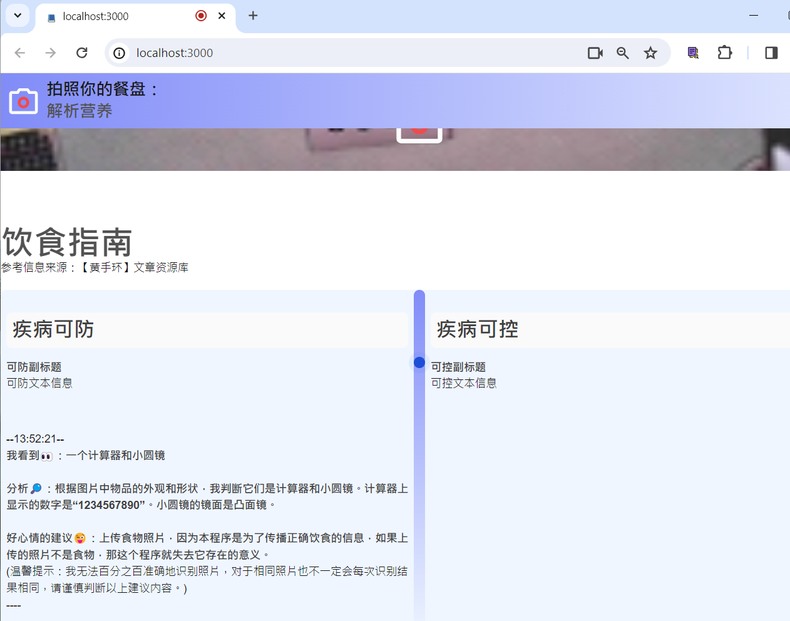

# llm-cam + Gemini (Node.js & Express.js)

3-24 deployed AWS 


front
```
/views_css
templates/food1.txt
templates/food2.txt
assets/page.json
photo.js
```

backend
```
./
index.js
```

## Installation

1. Clone the repository
2. Install the dependencies
   ```sh
   npm install
   ```

## Usage

1. Add your Google API key to the `.env` file
   ```env
   GOOGLE_API_KEY=your_google_api_key
   ```
2. Run the script with Node.js
   ```sh
   node index.js
   ```
3. Or use API in Postman
   ```sh
   npm start
   ```

## Functionality
The script uses the Google Generative AI library to generate content based on a template and an image. The `model.generateContent` function is used to generate the content. It takes an array as an argument, which includes the template and the image data. The generated content is then logged to the console or sent in API response.


